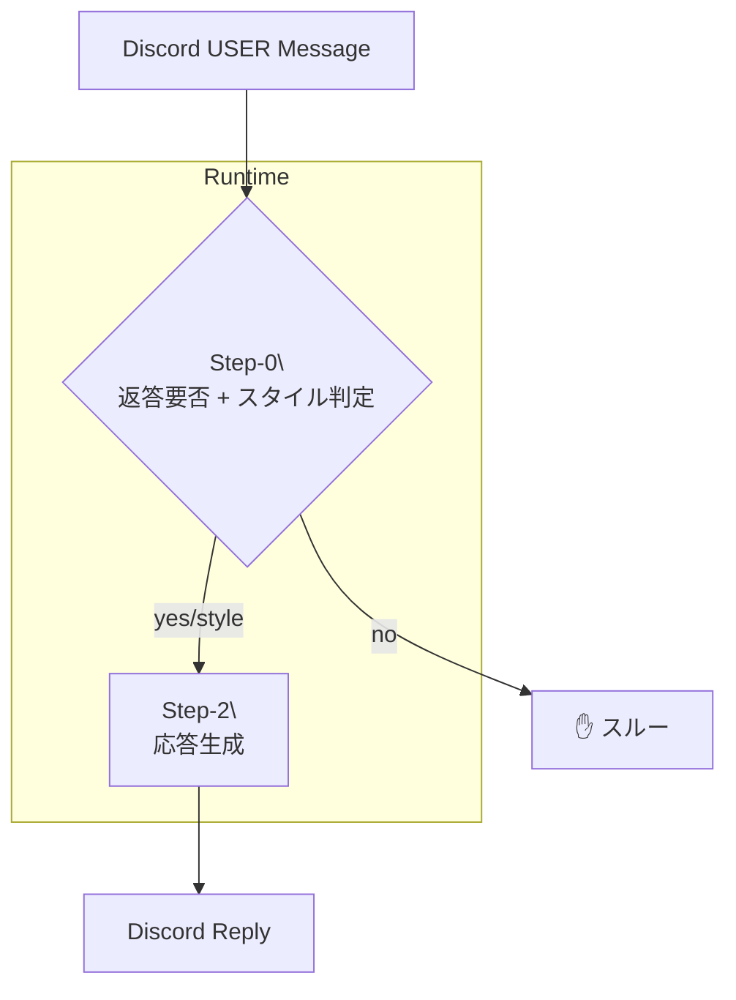

# 二段階→三段階プロンプト選択システム — **Version 2** 要件定義 & 作業指示書
*Updated: 2025-05-06 12:59*

---

## 0. 本ドキュメントについて
- **目的**  
  Discord Bot **natural‑gaku‑co** に
  1) 返答要否判定 → 2) スタイル分類 → 3) 応答生成
  という **三段階パイプライン** を実装し、  
  ルームルールに沿った “黙る勇気” を持つ会話 AI を実現する。  
- **対象読者** : Cursor IDE 上で作業する *GPT‑4.1*。  
- **編集ポリシー** : 目的優先・柔軟対応可。不明点は *必ず Akira* へ確認。

---

## 1. 全体アーキテクチャ


| フェーズ | 処理 | 主要ファイル |
|----------|------|--------------|
| **Step‑0** | ルームルールと文脈を踏まえ、返答するか否か＋最適スタイルを決定 | `src/decisionAndStyle.ts`<br>`config/room_rules.yaml`<br>`config/prompt_styles.yaml` |
| **Step‑1** | _（Step‑0 に包含したため不要）_ | — |
| **Step‑2** | 決定スタイルの System Prompt で応答生成 | `src/responseGenerator.ts`<br>`config/system_prompts/` |

---

## 2. ルームルール定義ファイル
`config/room_rules.yaml`
```yaml
rules:
  - id: silent_without_nomination
    description: >
      他者から指名・メンションされない限り発言しない。
  - id: facilitator_priority
    description: >
      ファシリテーター(ガクチョ)の指示を最優先せよ。
  - id: turn_passing_rule
    description: >
      自分の発言の最後に必ず YOWAI, がっこちゃん, ボッチー, 私 の誰かを指名。

bots:
  - name: がっこちゃん
  - name: ボッチー
facilitator: ガクチョ
```

---

## 3. 機能要件（V2差分）
| # | 要件 | 新旧 |
|---|------|------|
| 1 | **返答要否判定** — `should_respond` を判断 | ★New |
| 2 | スタイル分類 — `selected_style` を決定 | 旧 Step‑1 (統合) |
| 3 | 応答生成 — System Prompt に従い返答 | 旧 Step‑2 |

---

## 4. 非機能要件（追加）
- **ルームルール変更** は `room_rules.yaml` だけで完結  
- 判定失敗時は `should_respond=false` で安全停止  
- `should_respond` と `reason` をログに必ず残す

---

## 5. 追加/変更ディレクトリ構成
```
natural-gaku-co/
├─ src/
│  ├─ decisionAndStyle.ts      ← ★ New (Step‑0)
│  ├─ responseGenerator.ts     ← Step‑2
│  └─ index.ts                 ← Discord handler 改修
├─ config/
│  ├─ room_rules.yaml          ← ★ New
│  ├─ prompt_styles.yaml       ← 既存
│  └─ system_prompts/
│       ⋯
└─ tests/
   ├─ decisionAndStyle.test.ts ← ★ New
   └─ …
```

---

## 6. Step‑0 実装サンプル `decisionAndStyle.ts`
```ts
import fs from 'fs';
import yaml from 'yaml';
import OpenAI from 'openai';

const openai = new OpenAI();
const styleYaml = fs.readFileSync('config/prompt_styles.yaml','utf8');
const ruleYaml  = fs.readFileSync('config/room_rules.yaml', 'utf8');

export async function decideAndClassify(message: string) {
  const prompt = `
あなたは Discord の会話モデレーター AI。
# ユーザー発言:
${message}

# ルームルール (YAML):
${ruleYaml}

# スタイル定義:
${styleYaml}

▼ 判断基準
- ルール silent_without_nomination に反する場合 should_respond=false
- 指名/質問/メンション等で自分宛なら true
- true の場合は最適な selected_style を選ぶ

出力は JSON:
{{
  "should_respond": true|false,
  "selected_style": "<style_key or null>",
  "reason": "<80字以内>"
}}
`;
  const res = await openai.chat.completions.create({
    model: 'gpt-4o-mini',
    messages: [{role:'user', content: prompt}],
    temperature: 0.0,
  });

  return JSON.parse(res.choices[0].message.content);
}
```

---

## 7. Discord ハンドラ改修
```ts
import { decideAndClassify } from './decisionAndStyle';
import { generateReply }    from './responseGenerator';

client.on('messageCreate', async (msg) => {
  if (msg.author.bot) return;
  const { should_respond, selected_style } =
        await decideAndClassify(msg.content);

  if (!should_respond) return;  // スルー

  const reply = await generateReply(selected_style || 'default', msg.content);
  msg.reply(reply);
});
```

---

## 8. テスト追加例
| 入力メッセージ | 期待値 |
|----------------|--------|
| 「がっこちゃんって便利！」 | should_respond=false |
| 「がっこちゃん、これどう思う？」 | should_respond=true & 適切 style |
| 「ボッチーは意見ある？」 | ボッチー側で should_respond=true |

---

## 9. 作業タスク (差分)
1. 既存ブランチ `feature/prompt-selection` に続けてコミット  
2. `decisionAndStyle.ts`・`room_rules.yaml` 追加  
3. `index.ts` を Step‑0 対応に改修  
4. テスト実装 & pass を確認  
5. レビュー → PM2 / Docker 再デプロイ

---

## 10. 柔軟対応ガイド
- 判定精度向上には `message.mentions`, `reply_to_id` 等を Step‑0 プロンプトへ追加して良い  
- ルーム毎に異なるルールを持たせる場合は YAML をフォルダ分け ＋ 動的ロードOK  
- 迷ったら **Akira** に確認し、目的を常に優先すること

---

*End of Document — Version 2*
