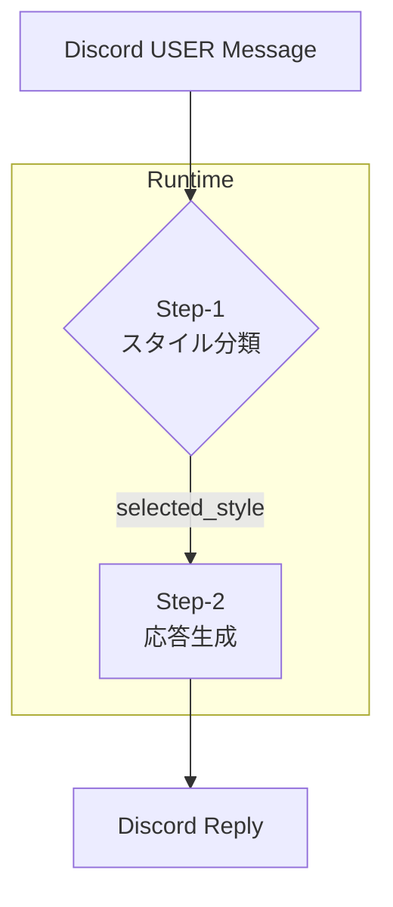

# 二段階プロンプト選択システム — 要件定義 & 作業指示書

## 0. 本ドキュメントについて
- **目的**: Discord Bot *natural-gaku-co* に「ユーザー発言を解析 → 最適な返答スタイルを選択 → 返答生成」という二段階パイプラインを実装する。  
- **対象読者**: Cursor IDE で作業する GPT‑4.1。  
- **編集方針**: 目的を優先し、指示に縛られず柔軟に判断して改善してよい。  
- **免責**: 不明点があれば *必ず* Akira に確認を取ること。

---

## 1. 全体アーキテクチャ



| フェーズ | 処理 | 使用ファイル/モジュール |
|----------|------|-------------------------|
| **Step‑1** | LLM でユーザー発言を解析し `selected_style` を決定 | `src/promptClassifier.ts`<br>`config/prompt_styles.yaml` |
| **Step‑2** | 決定したスタイルに対応する System Prompt で LLM から応答を生成 | `src/responseGenerator.ts`<br>`config/system_prompts/` |

---

## 2. 機能要件

1. **スタイル分類**  
   - YAML 定義の複数スタイルから 1 つを選択する  
   - 出力 JSON: `{selected_style: string, reason: string}`

2. **応答生成**  
   - `selected_style` に紐付く System Prompt を読み込み、LLM へ投げ返答を得る  
   - 返答の最大長は各 Prompt 内の指示に従う

3. **高可用**  
   - Step‐1 が失敗した場合は `default` スタイルでフォールバック

4. **設定の外部化**  
   - スタイル定義・System Prompt は YAML/Markdown ファイルで管理し、再デプロイ無しで差し替え可

---

## 3. 非機能要件

| 項目 | 要件 |
|------|------|
| **シンプル構造** | 既存の `natural-gaku-co` に最小限の追加ファイルで搭載 |
| **依存追加** | `yaml`, `openai` (又は互換 SDK) 以外は極力増やさない |
| **ロギング** | Step-1, Step-2 のリクエスト / レスポンスを `debug` レベルで残す |
| **テスト** | スタブ送信で 5 パターン以上のスタイル選択が正しいことを確認 |

---

## 4. ディレクトリ構成 (追加分)

```
natural-gaku-co/
├─ src/
│  ├─ promptClassifier.ts       ← Step‑1
│  ├─ responseGenerator.ts      ← Step‑2
│  └─ index.ts (既存 handler にフック)
├─ config/
│  ├─ prompt_styles.yaml        ← スタイル定義
│  └─ system_prompts/
│     ├─ short_positive_reaction.md
│     ├─ deep_analysis.md
│     └─ empathetic_human.md
└─ tests/
   └─ promptClassifier.test.ts
```

---

## 5. `prompt_styles.yaml` テンプレート

```yaml
styles:
  short_positive_reaction:
    description: >
      シンプルかつ肯定的。アイディア共有・ニュース報告向け。
    examples:
      - "昨日こんな記事を読んだよ"
      - "新しいアイデアが浮かんだ！"

  deep_analysis:
    description: >
      背景の構造や影響を掘り下げて論じる。
    examples:
      - "SNS疲れが社会に与える影響って？"
      - "働くとは何か、考えている。"

  empathetic_human:
    description: >
      感情に寄り添い、共感を示す。
    examples:
      - "最近ちょっとつらいな"
      - "気持ちが落ち込む"
```

---

## 6. Step‑1: `promptClassifier.ts` 概要

```ts
import fs from 'fs';
import yaml from 'yaml';
import OpenAI from 'openai';

const openai = new OpenAI();

export async function classifyPrompt(message: string) {
  const yamlText = fs.readFileSync('config/prompt_styles.yaml', 'utf8');
  const prompt = `
あなたはスタイル分類器です。
# ユーザー発言:
${message}

# スタイル定義 (YAML):
${yamlText}

出力は JSON:
{
  "selected_style": string,  // YAMLのキー
  "reason": string           // 日本語で簡潔に
}`;
  const res = await openai.chat.completions.create({
    model: 'gpt-4o-mini',
    messages: [{ role: 'user', content: prompt }],
    temperature: 0.2,
  });
  return JSON.parse(res.choices[0].message.content);
}
```

---

## 7. Step‑2: `responseGenerator.ts` 概要

```ts
import fs from 'fs';
import OpenAI from 'openai';

const openai = new OpenAI();

export async function generateReply(style: string, user: string) {
  const systemPrompt = fs.readFileSync(
    `config/system_prompts/${style}.md`, 'utf8'
  );
  const res = await openai.chat.completions.create({
    model: 'gpt-4o-mini',
    messages: [
      { role: 'system', content: systemPrompt },
      { role: 'user', content: user },
    ],
    temperature: 0.7,
  });
  return res.choices[0].message.content.trim();
}
```

---

## 8. Discord 連携手順 (index.ts 既存想定)

```ts
import { classifyPrompt } from './promptClassifier';
import { generateReply } from './responseGenerator';

client.on('messageCreate', async (msg) => {
  if (msg.author.bot) return;
  const { selected_style } = await classifyPrompt(msg.content);
  const reply = await generateReply(selected_style, msg.content);
  msg.reply(reply);
});
```

---

## 9. 作業タスク一覧 (Cursor GPT‑4.1)

1. **ブランチ作成**: `feature/prompt-selection`
2. **依存追加**: `pnpm add yaml openai`
3. **ディレクトリ/ファイル**: §4 の構成で雛形を配置
4. **Step‑1 実装**: `promptClassifier.ts` を完成
5. **Step‑2 実装**: `responseGenerator.ts` を完成
6. **System Prompts**: 3 つの MD ファイルにスタイルごとの指示を記述
7. **Handler改修**: Discord bot listener を新ロジックへ
8. **テスト**: `tests/promptClassifier.test.ts` で ex. 6発言を分類
9. **レビュー & PR**: 目的に沿うかチェック。不明点はAkiraへ確認
10. **デプロイ**: PM2 再起動 or Docker rebuild

---

## 10. サンプル System Prompt (`short_positive_reaction.md`)

```
あなたは元気でポジティブな相槌の名人です。
- 返答は 120 字以内。
- 絵文字 1〜2 個まで使用可。
- ユーザーが共有した内容に対して肯定し、一言質問があれば加えても良い。
```

---

## 11. 柔軟対応ガイド

- **ルールはあくまで指針**。状況に応じて prompt を調整して良い  
- **YAML 変更** でスタイルを増やす場合は `system_prompts/` に同名ファイルを追加すれば動く設計  
- 疑問点・仕様矛盾があれば *必ず* Akira へエスカレーションすること

---

## 12. 付録: テスト用ダミー入力例

| 入力メッセージ | 期待スタイル |
|----------------|--------------|
| 「新しいブログ書いたよ！」 | short_positive_reaction |
| 「ここ数日ちょっとメンタル落ちてる」 | empathetic_human |
| 「SNSが社会に与える影響についてどう思う？」 | deep_analysis |

---

*Last updated: 2025‑05‑05 (Asia/Tokyo)*
